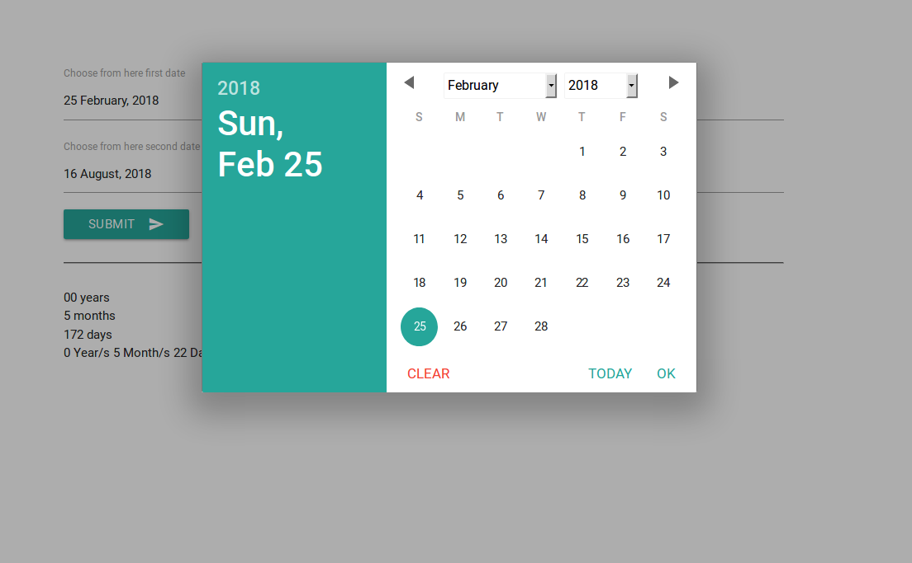

# DateDifference
A very simple project on php which show you time difference between two dates in months, years, days

You can try it <a href="http://datedifference.graphicsandphotos.com/">here.</a>